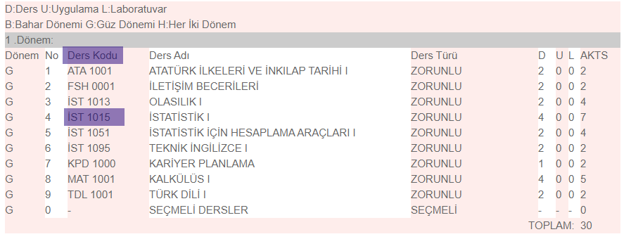
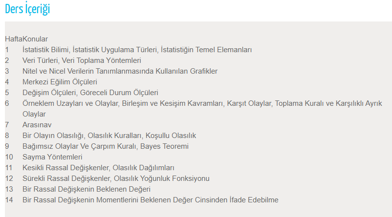

# İstatistik Bölümü
Herkese merhaba,

Her üniversite tercih döneminde olduğu gibi bu sıralar da İstatistik Bölümünü ile ilgili sorular alıyorum. Bu yüzden öğrenci arkadaşlarımızın ihtiyaç duyabileceğini düşünerek verdiğim cevaplardan bir kısmını burada paylaşmak istedim. Cevaplar, gördüklerime dayanarak kişisel düşüncelerimdir. Herhangi bir araştırma sonuçlarına dayanmamaktadır.

Bu tercih dönemindeki araştırmalarda ilk defa İstatistik bölümünü duyanlar olmuş. Lisede gördüğünüz permütasyon, kombinasyon, pasta grafikleri, veri analizi konuları İstatistik bölümünün giriş konularındandır. Bu yüzden İstatistiğe pek de yabancı sayılmazsınız. Aslında İstatistik günlük hayatta her yerde vardır. O kadar alışılmış davranışlardır ki bunların birer istatistik olduğunun farkında bile olmayız. Örneğin bir çorbaya yeterli tuz atılıp atılmadığını öğrenmek istediğinizi düşünün. Bu durumda bir kaşık çorba alıp, onun tadına bakarsınız. Eğer o bir kaşık çorba tuzlu ise kalan çorbanın da tuzlu olduğunu düşünürsünüz. İşte buradaki bir kaşık çorba sizin örnekleminizdir. Örneklemden yola çıkarak kitle/ana kütle olan çorbanın durumunu tahmin etmektesinizdir. 😊

## İstatistik Bölüm Dersleri ve Ders İçerikleri

İstatistik bölümü üniversiteden üniversiteye içerik olarak değişiklik göstermektedir. Çoğu İstatistik bölümü İngilizce ağırlıklı(~%70) işleniyor. Üniversiteler bir süredir bölümlerde bulunan derslerin listesini ve bu derslerin haftalık işleyecekleri konuları web sitelerinde paylaşıyor. Bu sayfalar üzerinden ders içeriklerine bakıp fikir edinebileceğiniz gibi üniversitelerin bölümlerinin içeriklerini de kıyaslayabilirsiniz. Örnek olarak: http://debis.deu.edu.tr/ders-katalog/2020-2021/tr/bolum_1135_tr.html adresinde “Ders Yapısı ve Kredileri” başlığı altında dönemlik olarak dersleri görebilirsiniz.

 “Ders Kodu” sütununda yer “İST 1015” gibi kodlara tıklayarak o dersin sayfasını ziyaret edebilirsiniz. Biraz uzun sürecek bir iş gibi görünebilir lakin bölüme başladığınızda bu araştırmaların avantajını göreceksinizdir.

## İstatistik Bölümünü Tercih Etmeden Önce 

### Eğitim Dili

İstatistik bölümünü tercih etmeden önce şunları düşünmeniz gerekenlerden biri tercih edeceğiniz üniversitedeki bölümün eğitim dilidir. Eğitim dilinin Türkçe olması devlet kurumlarında çalışmak için kolaylık sağlar. Bunun en büyük sebebi yabancı kökenli kavramların Türkçe karşılıklarını veya karşılığı bulunmayanlar için yeni türetilmiş Türkçe kelimeleri öğrenmenizdir. Eğitim dilinin İngilizce olması durumunda bu kelimeleri görmediğiniz için ilk karşılaştığınızda kültür şoku etkisi yaratmaktadır. İngilizce olmasının katkısı ise, iş başvurusu yapılabilecek yerlerin sayısının artması. Yabancı ve Türk firmalarının çoğunun iş başvuru koşullarında iyi derecede İngilizce istenmesi. Bunun sebebi iş sırasında İngilizce konuşulması, raporların İngilizce hazırlanması ve sunulması gibi örnekler verilebilir. Eğitim dili bazı üniversitelerde İngilizce ve Türkçe karışık bir şekilde veriliyor. Bunlar %30, %70 İngilizce gibi belirtiliyor. Bu eğitimin avantajı hem Türkçe hem de İngilizce kavramları öğrenmiş olmak. Dezavantajı ise %100 İngilizce olan bölümlerdeki gibi bir İngilizce bilgisi edinememektir.

#### İngilizce Hazırlık

Kısmi İngilizce veya %100 İngilizce Bölümlerde İngilizce hazırlık zorunluluğu vardır. Hazırlığı sene kaybı olarak görenler için şunu belirtmekte fayda var. Hazırlık gereklidir ve orada öğrenilen İngilizce'nin kalıcılığı sağlanıp hatta üzerine eklenmelidir. Aksi durumda hangi bölüm olursa olsun bitirildiğinde İngilizce kursuna gidilmesi şart olacağından sene kaybı burada söz konusu olmaktadır.

Yeterli İngilizce seviyesine sahip kişilerin hazırlıktan **muaf** olabilmesi için sınav yapılmaktadır. Bu sınav neticesinde bölüme geçme şansı elde edilebilmektedir. Başarısız olunması durumunda hazırlık okunacak ve o yıla ait sınavın veya sınavların sonuçlarından başarılı olunması gerekmektedir. Başarısızlık durumunda **tekrar** hazırlık okunulmaktadır. 

### Matematik

Tercih etmeden önce şunları düşünmeniz gerekenlerden ikincisi ise Matematik bilgisidir. 

[Kalkülüs I](http://debis.deu.edu.tr/ders-katalog/2020-2021/tr/tr_1135_1135_563.html) ve [Kalkülüs II](http://debis.deu.edu.tr/ders-katalog/2020-2021/tr/tr_1135_1135_566.html) derslerinde işlenen türev ve integral gibi konuların İstatistik derslerinin temelini oluşturmaktadır. Örneğin, sürekli bir dağılımın belirli bir aralığa ait beklenen değerini bulmak için integral kullanılmaktadır. 

Birinci sınıfı tekrar okumak zorunda kalanların çok büyük bir kısmı bu konuları yapamayanlardan oluşmaktadır. Üniversiteye geçiş sınavında bu konulardan yeterli netiniz yoksa, bu konuları yapabileceğinize inanmıyorsanız tercih etmenizi tavsiye etmemekteyim.

### Bilgisayar

Düşünmeniz gerekenlerden bir diğeri ise Bilgisayar bilgisidir. Burada bahsetmek istediğim, bilgisayarı açıp sosyal medyada uzun süre gezmeniz, oyunları iyi oynamanızdan ziyade Algoritma kavramını öğrenmeniz ve uygulayabilme yeteneğiniz. 

Çoğu üniversitede öğrenilen bilgileri bilgisayar ortamında uygulamanız için ilk dönemden başlayarak bilgisayar dersleri verilmektedir. Bu bilgisayar derslerinde Minitab, SPSS, Excel gibi programların yanında, R, Python programlama dilleri öğretilmekte ve bular üzerinde istatistik uygulamanız istenmektedir.

Excel'i daha önce açmış olanlarınız olabilir. Bu programları öğrenmek, uygulamak kolay gibi görünebilir, lakin öğrenci arkadaşlarımızda gördüğüm kadarıyla şunu söyleyebilirim ki bölümü bitirmek üzere olan arkadaşlar da bile bu programları kullanma zorluğunu gördüm. Mezun olduğunuzda neredeyse bütün işiniz bilgisayar üzerinden olacağını belirtip, eğer bu konuda bir sıkıntı yaşayacağınızı düşünüyorsanız. Kesinlikle çoğu mühendislik ve fen fakültesi bölümlerini tercih etmenizi önermemekteyim. 

 Kısaca özetlemek gerekirse, sırasıyla kalkülüs, ingilizce ve bilgisayar derslerini yapamayacak durumda olanların, İstatistik bölümünü vaktinde veya vaktine yakın zamanda bitirebilmesi zordur. Bu durumu tercih ederken düşünmenizi tavsiye ederim.

## Kimler Tercih Etmeli?

Aslında kimlerin tercih etmemesi gerektiğini belirtmiştim. Buradan yola çıkarak kimlerin tercih edebileceği belli olmaktadır lakin harici bir soru olarak ele alıp kısaca cevap vermemiz gerekirse: İstatistik bölümü olayların koşullarını veya şartlarını iyi şekilde kavrayabilen, analitik düşünerek çözümler üretebilen kişilere uygundur. Eldeki verileri çeşitli süzgeçlerden geçirip, elde edilen verilerden anlamlı bilgiler üretip bunları sunabilme yeteneği istemektedir.

## İş İmkanları

İş imkanları hakkında oldukça fazla soru alıyorum. Bunun sebebinin internette araştırıp bu konuda pek bilgi edinemediğinizden dolayı olduğunu görüyorum. Bu konuda güzel bir araştırma yapılmadan detaylı bir bilgi sunmak da oldukça güç bir durum. Bu bölümde yazdıklarımı detaylandırmak adına daha sonra araştırma yapıp güncellemeyi düşünüyorum. 

Yurt dışında kıymeti büyük, Türkiye'de ise gittikçe bilinirliği ve önemi artan bir bölümdür. Günümüzde Veri Bilimi, Yapay Zeka, Makine Öğrenmesi gibi kavramlarla daha da gün yüzüne çıkmaya başlamıştır. Her fabrikada, her şirkette iş imkanı vardır lakin bu iş imkanları bölümün alt dallarına göre değişmektedir. Kalite departmanında kalite kontrol uzmanı olarak çalışma imkanı varken, başka departmanlarda, analist/analizör, biyoistatistikçi, veri bilimci, yazılım uzmanı gibi çalışma imkanları vardır. Bölümde bunun gibi alanlara ait seçmeli dersler açılmaktadır ve öğrencilerin ilgilendikleri alanlara ait dersleri alabilmeleri sağlanmaktadır. Yapılan iş alanına göre alım sayısı az olabilmektedir lakin alan sayısının fazla olması bu durumu eşitlemektedir.

 İstatistikçilerin iş imkanları bulabildikleri kamu kurumları:

- Hastanelerin istatistik büroları,
- Türkiye İstatistik Kurumu (TÜİK), 
- Strateji ve Bütçe Başkanlığı (SBB), 
- Türkiye Bilimsel ve Teknik Araştırma Kurumu (TÜBİTAK), 
- Türk Standartları Enstitüsü (TSE), 
- Türkiye Kömür İşletmeleri (TKİ) 

İstatistik mesleği birçok bilim dalı ile iç içedir. Teknolojinin sürekli gelişmesiyle istatistik bilgisine ve istatistikçiye ihtiyaç duyulan alanlar: biyoloji, işletmecilik, demografi, ekonomi, mühendislik, sağlık, sigortacılık, pazarlama ve tüketim araştırması, tıp, yöneylem araştırması, psikoloji, sosyal bilimler, kalite kontrol, üretim kontrolü, AR-GE ve deney tasarımı.

Sorularınız için Gmail/Instagram/Linkedin/... üzerinde @hcemaras kullanıcı adını aratarak ulaşabilirsiniz.
